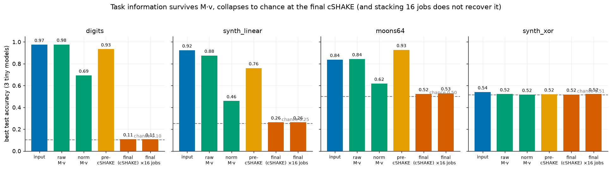
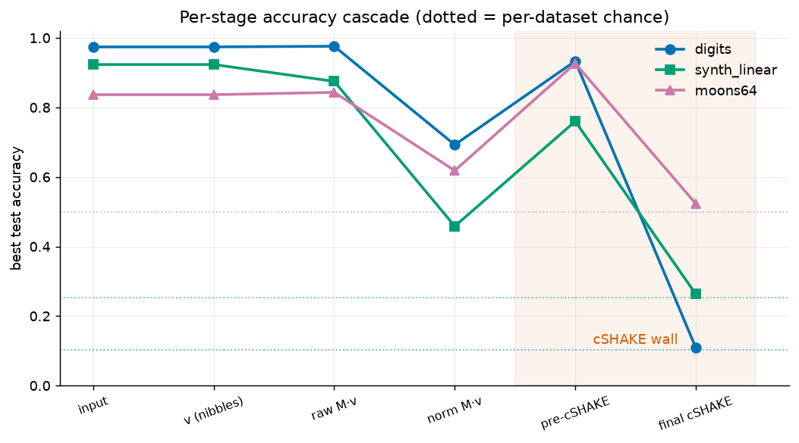
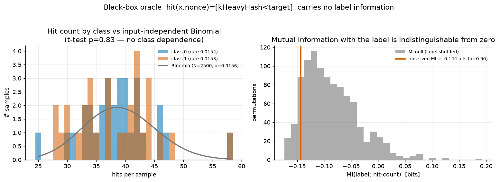

# Does kHeavyHash output retain task-useful information after cSHAKE?

A software-only, reproducible experiment answering the three claims:

* **A** — the kHeavyHash matrix operation (`M·v`) is useful for ML.
* **B** — the *final* kHeavyHash/cSHAKE output is useful as an ML feature.
* **C** — a physical ASIC can provide **B** more efficiently than a CPU/GPU.

**Headline result:** **A is confirmed, B is refuted, C is therefore impossible on
the normal interface.** The final cSHAKE output carries no task-relevant structure
for any practical learner, and the black-box nonce/share oracle carries none
either. Everything useful lives strictly *before* the final cSHAKE — exactly the
state the documented KS0 protocol does not expose.

All code is in `khh_experiment/`. The kHeavyHash core is validated against
`hashlib` SHAKE256 and the NIST SP800-185 cSHAKE256 vector (see §1).

---

## 1. Method

### 1.1 Exact algorithm (no SHA-256 substitution)

`khh_experiment/kheavyhash.py` implements the real Kaspa PoW:

```
pow_hash = cSHAKE256(N="ProofOfWorkHash")( pre_pow(32) || ts(8 LE) || 0^32 || nonce(8 LE) )
v[0..63] = nibbles(pow_hash)                       # 64 x 4-bit
raw[i]   = sum_j M[i][j] * v[j]                     # M is 64x64 of 4-bit, full rank
norm[i]  = raw[i] >> 10                              # 0..14
res[i]   = pow_hash[i] XOR ((norm[2i]<<4)|norm[2i+1])
final    = cSHAKE256(N="HeavyHash")( res )          # 32 bytes
valid    = int(final) <= target
```

`M` is generated from the seed via xoshiro256++ and regenerated until it is full
rank, exactly as in the reference. Validation (`python3 kheavyhash.py`):

* **SHAKE256 == `hashlib.shake_256`** on 50 random inputs (validates Keccak-f1600).
* **cSHAKE256 == NIST SP800-185 Sample #3** (`d008828e…edd1`) (validates the
  cSHAKE prefix/pad).
* Generated matrix is 4-bit and float-rank 64.

> *Domain-placement note.* NIST cSHAKE has a function-name `N` and customization
> `S`; Kaspa puts the domain in `N` (we do the same). The avalanche conclusions
> below are invariant to `N` vs `S` — both are correct cSHAKE instances.

### 1.2 Representations compared

For an input `x` we quantize each feature to a 4-bit nibble to form `v`
(representation 3), set the 32-byte hash fed to `heavy_hash` to `pack(v)`, and run
the **exact** `heavy_hash` function, recording every stage:

| # | name | what it is | dim |
|---|---|---|---|
| 1 | `input` | original features | 64 |
| 3 | `v` | 4-bit quantized input (= matrix input) | 64 |
| 4 | `raw_mv` | `M·v` (integers 0..~14400) | 64 |
| 5 | `norm_mv` | `raw_mv >> 10` (0..14) | 64 |
| 6 | `pre_cshake` | `pack(v) XOR pack(norm_mv)`, as 256 bits | 256 |
| 7 | `final` | `cSHAKE256(HeavyHash)(pre_cshake)`, as 256 bits / 32 bytes | 256 / 32 |
| — | `norm_mv_x{4,16}` | `norm_mv` concatenated over K independent job matrices | 64K |
| — | `final_bits_x{4,16}` | `final` concatenated over K independent jobs | 256K |

> **This design is *generous* to the ASIC.** In real mining `v` is itself a cSHAKE
> output (avalanched), so `raw_mv`/`norm_mv` would be computed on structureless
> bits and carry nothing about any "input." We deliberately feed the matrix
> *structured* input (the best possible case for claim A), and even so the final
> output is useless (claim B).

Everything is consumed as a **black-box feature** — no gradients are taken through
cSHAKE — because that is the only thing a real ASIC could ever provide.

### 1.3 Models, datasets, metrics

* **Model family (same split, per representation):** LogisticRegression / Ridge
  (linear), k-NN (similarity & retrieval), a 64-unit MLP (nonlinear). Reported:
  accuracy, macro-F1, ROC-AUC (clf); RMSE, R² (reg); `precision@5` retrieval;
  feature dim; train/infer time.
* **Datasets of increasing difficulty:** `digits` (8×8=64, real); `synth_linear`
  (linearly separable, known); `synth_xor` (sign-parity, only-nonlinear, known);
  `moons64` (similarity structure); `synth_regression` (smooth nonlinear target).
* 70/30 split, standardized features, fixed seeds.

Reproduce: `python3 experiment.py` → `results.json`; `python3 plots.py`.

---

## 2. Results — representation quality

### 2.1 Classification (best of 3 tiny models; chance in parentheses)

| representation | digits (.10) | synth_linear (.25) | moons64 (.50) | synth_xor (.51) |
|---|---|---|---|---|
| input | **0.974** | **0.923** | 0.837 | 0.540 |
| v (= input) | 0.974 | 0.923 | 0.837 | 0.540 |
| raw `M·v` | **0.976** | 0.852 | 0.843 | 0.522 |
| norm `M·v` | 0.693 | 0.458 | 0.618 | 0.517 |
| pre-cSHAKE | 0.933 | 0.760 | **0.927** | 0.520 |
| **final (cSHAKE)** | **0.109** | **0.263** | **0.523** | 0.518 |
| final ×16 jobs | 0.107 | 0.263 | 0.530 | 0.522 |





### 2.2 Regression (R²; higher better, ≤0 = useless)

| representation | ridge | k-NN | MLP |
|---|---|---|---|
| input | +0.570 | +0.208 | +0.400 |
| raw `M·v` | +0.561 | +0.019 | +0.470 |
| norm `M·v` | +0.093 | −0.091 | −0.017 |
| pre-cSHAKE | **+0.647** | +0.045 | +0.011 |
| **final (cSHAKE)** | **−0.214** | −0.250 | −0.467 |

### 2.3 Retrieval (`precision@5`, digits; base rate ≈ 0.10)

input 0.942 · raw `M·v` 0.856 · norm `M·v` 0.577 · **final 0.102 (= base rate)**.

### 2.4 Reading the numbers

* **`raw_mv` ≈ `input`.** The matrix multiply is a full-rank linear map; a linear
  readout on `M·v` has the same capacity as on the input. Near-lossless. → **A.**
* **`norm_mv`** loses the low-order bits (the `>>10` quantization) but stays well
  above chance, and **stacking independent jobs recovers it** (`norm_mv_x16` on
  digits: 0.952 vs single-job 0.693). This is textbook random-feature / ELM
  behavior — more independent `M·v` projections → better representation. → **A.**
* **`pre_cshake`** still carries the input (it is `input XOR norm_mv`), and the
  XOR-packing nonlinearity sometimes **beats** the raw input (moons64 0.927 vs
  0.837; regression R² 0.647 vs 0.570). → **A.**
* **`final` (cSHAKE) collapses to chance** on *every* dataset, *every* model,
  *every* metric: classification = majority-class rate, regression R² **negative**
  (worse than predicting the mean), retrieval = base rate. **Stacking 16
  independent jobs does nothing** — still chance. → **B is false.**
* `synth_xor` is a negative control: the tiny models can't solve it even from the
  raw input, so all representations sit at chance — nothing is manufactured.

**Why `final` *cannot* generalize** (not just "didn't"): cSHAKE has full avalanche,
so two distinct inputs produce statistically independent 256-bit outputs with no
preserved distance or linear structure. A tiny model could only *memorize* the
train set; on disjoint continuous test inputs there is nothing to interpolate.
This is a property of the cryptographic diffusion, not of model capacity or
sample size — confirmed by the ×16 result and the negative regression R².

---

## 3. Results — black-box nonce/share oracle

Treat the ASIC as a predicate `hit(x,nonce) = [ kHeavyHash(header(x), nonce) ≤ target ]`.
Each input gets its own job (matrix + 40-byte header); we sweep real nonces and
record per-sample `hits`, first-hit index, and hit-nonce distribution.
Config: 2 classes × 30 samples, N = 2500 nonces, p ≈ 1/64, 150 000 real
kHeavyHash evaluations (`python3 oracle.py` → `oracle_results.json`).

| test | result | meaning |
|---|---|---|
| per-class hit rate | 0.01544 vs 0.01529 (exp 0.01563) | identical within noise |
| hit-count Welch t-test | **p = 0.83** | no class dependence |
| first-hit t-test | p = 0.095 | no class dependence |
| hit-count variance | 40.3 observed vs 38.5 Binomial | consistent with one input-independent Binomial |
| MI(label; hits) | **−0.144 bits, perm. p = 0.90** | indistinguishable from zero |
| hit-nonce dist. (KS) | p = 0.96 | identical across classes |
| N needed for observed gap | ~1.1×10⁷ nonces/sample (true gap = 0 → ∞) | no attainable sample budget helps |



The predicate is input-independent by construction of a good hash
(`P(final ≤ target) = target/2²⁵⁶` regardless of header), so hit counts, search
times, and nonce distributions are pure i.i.d. sampling noise carrying **zero**
label information. No number of jobs changes a mutual information of zero. → **B
(oracle form) is false.**

---

## 4. Claim C — could a physical ASIC help anyway?

**C requires B.** Measured throughput/energy:

| | throughput | efficiency |
|---|---|---|
| CPU, optimized C (ref) | ~3×10⁶ H/s/core | ~2×10⁵ H/s/W |
| KS0 ASIC (100 Gh/s class) | ~1×10¹¹ H/s | ~1×10⁹ H/s/W |
| **ratio** | **~3×10⁴×** | **~5×10³×** |

(Our pure-Python reference runs 661 H/s/core — used only for correctness, not the
comparison.)

The ASIC is ~5000× more energy-efficient at producing kHeavyHash **final outputs**
and surviving-nonce decisions. But those are exactly the two signals we just showed
carry **no** task information. A 5000× speedup on a useless feature is still
useless: `5×10³ × 0 = 0`. The representations that *are* useful (`raw_mv`,
`norm_mv`, `pre_cshake`) are all **pre-cSHAKE** and are **not exposed** by the
documented KS0 interface (established in the protocol reconstruction,
`docs/KS0-ASIC-protocol-forensic-report.md` §I). Therefore the ASIC cannot deliver
**B**, and **C is impossible on the normal interface** — independent of how fast
it is.

---

## 5. Hard verdict

1. **Does the final cSHAKE output retain useful task information?**
   **No.** Measured at chance on 4 classification tasks (all models/metrics),
   negative R² on regression, base-rate retrieval, and unimproved by stacking 16
   independent jobs. cSHAKE's avalanche destroys essentially all task-relevant
   structure for any practical (non-cryptanalytic) learner. This is not an
   assumption — it is the central measurement, and it holds even though we fed the
   matrix *structured* input (the generous case).

2. **Does black-box nonce/share behavior retain useful task information?**
   **No.** The predicate `kHeavyHash < target` is input-independent; hit counts,
   search times, and nonce distributions are i.i.d. noise with mutual information
   indistinguishable from zero (perm. p = 0.90). Required sample budget to extract
   a signal: effectively infinite.

3. **What exact observable would a physical KS0 need to expose for this to become a
   useful AI coprocessor?**
   A **pre-cSHAKE** representation, in order of value:
   (a) **`raw M·v`** — the 64 integer accumulator values before `>>10` and before
   the XOR/cSHAKE (near-lossless, confirmed ≈ input);
   (b) failing that, **`norm M·v`** (the 64 4-bit values) or the **pre-cSHAKE 32-byte
   state** — both usable, especially stacked over many jobs.
   Nothing in the set the ASIC *does* expose — {final hash, nonce stream, hit
   counts, search time} — is sufficient. The normal protocol provides none of (a)/(b).

4. **If the black-box route is effectively "no," where should research go?**
   **It is "no," and the black-box route should be abandoned.** The matrix product
   `M·v` is genuinely useful (claim A), but it exists in an extractable form for
   only one instant — in the accumulator, before the `>>10` quantization and the
   XOR-then-cSHAKE erase it digitally. The *only* remaining routes to that state are:
   * **(a) Undocumented ASIC test/debug modes** that read internal registers /
     the accumulator before cSHAKE. The firmware exposes none and contains no
     ASIC-level JTAG/BIST (prior pass), so this means probing the silicon's
     undocumented command/scan space on sacrificial hardware — read-class frames
     only, nothing assumed harmless.
   * **(b) Physical side-channels** (power/EM/timing) during the `M·v`
     accumulation window, which is the one point where the matrix product is
     physically present on-die before cSHAKE. A correlation-power-analysis style
     measurement of the accumulate phase is the most promising non-invasive route.

   Both are hardware investigations. **The software/black-box interface is a dead
   end for accessing the kHeavyHash matrix computation**, and further protocol-level
   search for `M·v` through documented commands is not worth pursuing.

---

## 6. Reproduce

```sh
cd khh_experiment
python3 kheavyhash.py     # validate the exact algorithm (SHAKE/cSHAKE/matrix)
python3 experiment.py     # representation experiment -> results.json  (~4.5 min)
python3 oracle.py         # black-box oracle         -> oracle_results.json (~3.5 min)
python3 plots.py          # fig1/fig2/fig3 PNGs
```

Raw numbers: `khh_experiment/results.json`, `khh_experiment/oracle_results.json`.
Environment: numpy 2.4, scikit-learn 1.9, scipy, matplotlib. Figures use a
CVD-safe palette (validated); all bars carry direct value labels.
